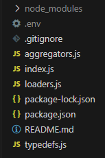

# OpenVolt

## Dependencies

This project was created using `Node v20.5.0` and `NPM 9.8.0`. You can use `NVM` to install matching versions before installing and running this project.

## Installation

```
npm install
```

## Environment variables

API keys and API URL's are expected to come from a `.env` file which needs to be created in the root directory before running the project. That file should look as follows:

```
API_KEY=XXX-XXX-XXX-XXX
METER_ID=XXXXXXXXXXXXXXXXXXXX
OPENVOLT_API_BASE_URL=https://api.openvolt.com/v1
CARBON_INTENSITY_API_BASE_URL=https://api.carbonintensity.org.uk
```

Replace `API_KEY` and `METER_ID` above.

Once you've created that file, your project folder structure should look as follows:



## Running the script

```
node index.js
```

## Other information

### Type Definitions

Rather than investing time into creating a "true" Typescript repo which would require additional build set-up, I have opted for using JSDoc to create light type definitions that give me some confidence about variable types in the editor. A Typescript approach would be much better but this at least gives some type safety in the IDE.

These types can be found [here](./typedefs.js)

### File Structure

#### loaders.js

This file contains a set of functions that are responsible for loading data from the different API sources and returning it.

#### aggregators.js

This file contains a set of functions that takes API data (OpenVolt, NationalGrid) and performs aggregations on it to return results e.g total energy consumed, total CO2 emitted, etc.

#### index.js

The main file of the project which:

1. Kicks off data loading using the helper functions from `loaders.js`
2. Passes the relevant data to the helper functions from `aggregators.js` to get the relevant results
3. Uses the information loaded and aggregated to output information to the user
